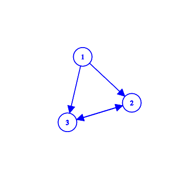

# :arrows_counterclockwise: Transaction Cycle Detection Given Schedule Table

Project for the class of Database I to simulate the testing of serializability. In order to simulate, we create a schedule table representing the transactions and their operations. The Schedule table has the following format:
- time: integer value, functioning as a timestamp of the operation done.
- #t: integer value, representing the transaction.
- op: R, W and C, representing Read, Write and Commit actions.
- attr: character value, representing attribute that can be read, written or commited. 

## :computer: The Algorithm

The algorithm can be found on the file [find_cycle.sql](algorithm/find_cycle.sql). It consists in creating a Graph table that represents a directed graph. Each arc (x, y) is represented by the tuple (origin, destiny). Afterwards, the function *testeEquivalenciaPorConflito* is executed and saved as *resp*, with **1** representing *has cycle* and **0** representing *does not have cycle*.

### Example 

Given the following transactions:

|  T1  |  T2  |  T3  |
|------|------|------|
| R(X) |      |      |
| W(X) |      |      |
|      | R(X) |      |
|      |      | R(X) |
| W(X) |      |      |
|      |      | W(X) |
|      | R(Y) |      |
|      | W(Y) |      |
|  C   |      |      |
|      |  C   |      |
|      |      |   C  |

The expected input values for the Schedule table is:
| time | #t | op | attr |   
|------|----|----|------|   
| 1    | 1  | R  | X    |   
| 2    | 1  | W  | X    |  
| 3    | 2  | R  | X    |   
| 4    | 3  | R  | X    |   
| 5    | 1  | W  | X    |   
| 6    | 3  | W  | X    |   
| 7    | 2  | R  | Y    |   
| 8    | 2  | W  | Y    |   
| 9    | 1  | C  | -    |   
| 10   | 2  | C  | -    |   
| 11   | 3  | C  | -    | 

After running the find_cycle.sql, the following Graph table will be created:
| origin | destiny |
|--------|---------|
|   1    |    2    |
|   1    |    3    |
|   2    |    3    |
|   3    |    2    | 

Representing the following directed graph:



Since there's a cycle from 2 to 3, the *testeEquivalenciaPorConflito* returns 1.

## :test_tube: Running the tests

To test the algorithm it's necessary to build and attaches the containers, then the tests can be ran. For that, you may use the following commands:

```sh
docker-compose up
docker exec db /bin/bash -c 'sh src/test.sh'
docker-compose down
```

The tests are located on the `test` directory, with the inputs and outputs files for each example. One of them is shown bellow.


## Github

[Link](https://github.com/beamaia/transaction-schedule-sql) to Access the full code.

## Special thanks

The detect cycle portion of the code was based on this [link](https://stackoverflow.com/questions/26671612/prevent-and-or-detect-cycles-in-postgres).